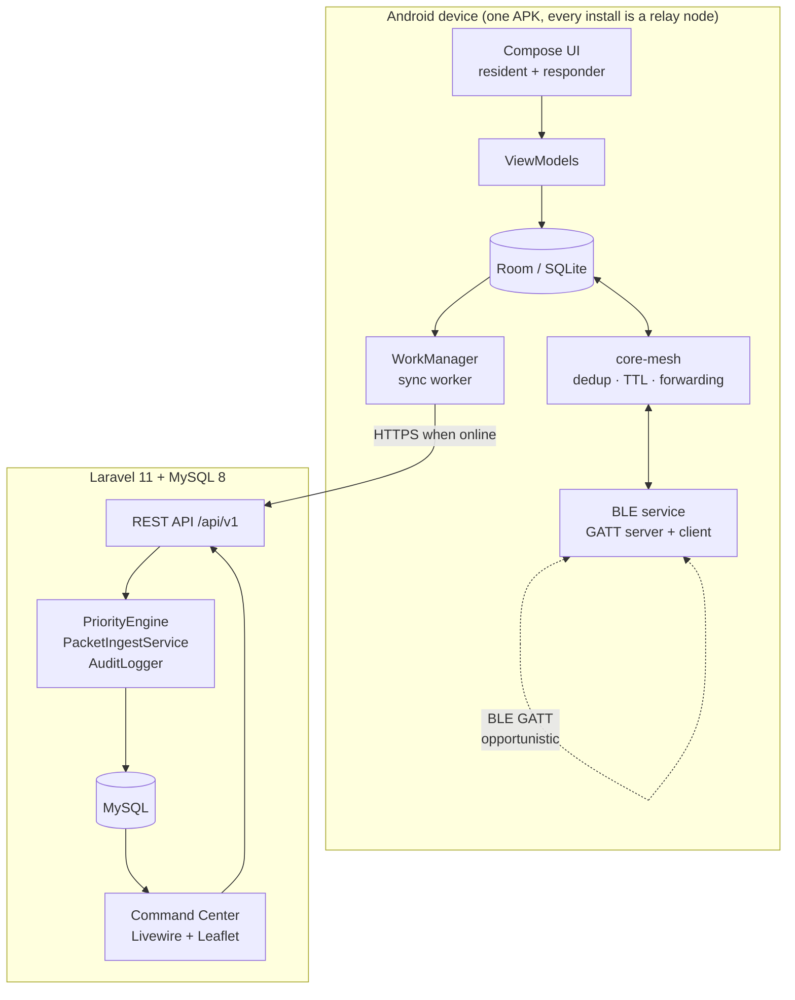

# 01 — System Architecture

> **Bulig: An Offline-First Emergency Communication and Disaster Response
> Coordination System for a Selected Barangay in Tacloban City**
>
> *Bulig* (Waray-Waray): "help."

---

## 1.1 The problem, stated precisely

A conventional emergency reporting application assumes a path:

```
Resident ──▶ Internet/Cellular ──▶ Server ──▶ Barangay
```

If the middle link fails, the report never leaves the phone. During a typhoon,
flood, or earthquake — exactly when reporting matters most — that link is the
first thing to fail.

Bulig removes the assumption that the resident's device must itself be online.
It only requires that *some* device, eventually, is.

## 1.2 The Bulig path

```
Resident's phone            Neighbour's phone         Phone near a live signal
┌────────────────┐          ┌────────────────┐        ┌────────────────┐
│ Create report  │          │                │        │                │
│ Save to Room   │──BLE────▶│ Store packet   │──BLE──▶│ Store packet   │
│ (no internet)  │          │ (no internet)  │        │ (HAS internet) │
└────────────────┘          └────────────────┘        └───────┬────────┘
                                                              │ HTTPS
                                                              ▼
                                                    ┌───────────────────┐
                                                    │ Laravel REST API  │
                                                    │   → MySQL 8       │
                                                    └─────────┬─────────┘
                                                              ▼
                                                    ┌───────────────────┐
                                                    │ Barangay Command  │
                                                    │ Center (Livewire) │
                                                    │ triage → assign   │
                                                    └─────────┬─────────┘
                                                              ▼
                                                       Responder app
                                                  accept → en route →
                                                  on site → resolved
```

**Creation, storage, and relay require no internet. Internet is required only at
the final hop.**

## 1.3 Layered view

| Layer | Technology | Responsibility |
|---|---|---|
| Presentation (mobile) | Kotlin + Jetpack Compose | Resident reporting, responder assignments, mesh/sync status |
| Presentation (web) | Blade + Tailwind + Alpine + Livewire | Barangay command center |
| Mesh transport | Android BLE (GATT, dual-role) | Device discovery, anti-entropy exchange, chunked packet transfer |
| Mesh logic | `:core-mesh` — pure Kotlin, no Android deps | Dedup, TTL, hop count, forwarding eligibility |
| Local persistence | Room / SQLite | Emergencies, packets, outbox, seen-set |
| Sync | WorkManager + Retrofit | Deferred, idempotent batch upload |
| API | Laravel 11 / PHP 8.4 / Sanctum | Ingest, validation, RBAC, incident coordination |
| Central persistence | MySQL 8 | Single source of truth |
| Mapping | Leaflet + OpenStreetMap | Incident geospatial display |

## 1.4 Architectural principles

**P1 — Local-first.** The device database is authoritative for the device. The
server is a destination, not a dependency. No user-facing action blocks on the
network.

**P2 — Device-minted identity.** `emergency_id` and `packet_id` are UUIDv4
generated on the phone. The server cannot issue an ID to a device it cannot
reach, so it never tries. It accepts IDs and enforces uniqueness on them.

**P3 — Immutable packet identity, mutable packet header.** `packet_id` is
created once at the origin and never rewritten. `hop_count` and `ttl` change at
every hop. This split is what makes loop suppression work — see `06-ble-protocol.md`.

**P4 — Idempotent ingestion.** Any packet may arrive any number of times by any
number of routes. Submitting the same packet twice must produce the same result
as submitting it once. See `07-offline-sync.md`.

**P5 — Explainability over cleverness.** Priority is a documented, deterministic
rule set that emits its own reasoning. No machine learning in the core system.
See `08-priority-engine.md`.

**P6 — Opportunistic, not guaranteed.** Bulig improves the probability that a
report escapes an outage. It never promises delivery, and the UI says so
plainly. See `LIMITATIONS.md`.

**P7 — Self-instrumenting.** The system records the data needed for its own
ISO/IEC 25010 evaluation. Metrics are queried from the database, not measured
with a stopwatch. See `10-testing-plan.md`.

## 1.5 Component diagram



## 1.6 What is deliberately excluded

Per the capstone scope rule: no machine learning, no biometrics, no drone or
satellite integration, no government API integration, no blockchain, no
microservices. The prototype is Android + BLE + Room + Laravel + MySQL + a web
command center — and nothing more.

## 1.7 Field data status

Barangay-specific facts — current emergency procedure, resident population,
present response times, existing communication tools, connectivity conditions —
are **TO BE VALIDATED** through interviews, observation, and approved barangay
records. No such figure appears anywhere in this repository unless it carries a
citation. Placeholder statistics are not used.
