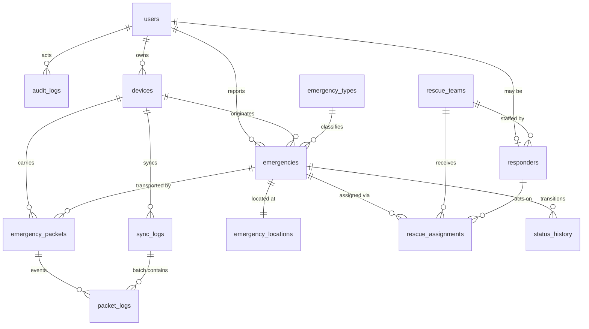

# 04 — Database Design (ERD + Data Dictionary)

MySQL 8 (InnoDB, `utf8mb4_unicode_ci`). SQLite is used for local test runs; no
MySQL-only syntax is used in migrations.

## 4.1 ERD

## 4.2 Design decisions worth defending

**Why `emergency_id` is a UUID and not the primary key.** Tables keep a `BIGINT`
auto-increment `id` for join performance, and carry the device-minted
`emergency_id CHAR(36)` as a `UNIQUE` business key. Best of both: fast indexes,
and an identity that can be created with no server present. Ingestion upserts on
`emergency_id`.

**Why location is a separate table.** `emergency_locations` is 1:1 with
`emergencies` and holds `latitude`, `longitude`, `accuracy_m`, `captured_at`,
`provider`, and `is_approximate`. Splitting it keeps the geospatial column set
independently permissioned (a responder outside the assignment may be served an
incident *without* its location row) and leaves room for a later revision
history without widening the hot table.

**Why packets are separate from emergencies.** One emergency may be carried by
many packets and arrive by many routes. The packet table is the transport
record; the emergency table is the logical record. Conflating them is the single
most common way this architecture is implemented wrongly.

**Why three timestamps per packet.** `created_at_device` (origin clock),
`received_at_server` (server clock), and `clock_offset_ms` (measured at sync).
Offline phones drift. Without the offset, every transmission-delay figure in the
evaluation is unreliable — see `07-offline-sync.md` §7.6.

**Why `priority_breakdown` is JSON.** The command center must answer "why is this
CRITICAL?" with the actual rule trace, not a bare number. Storing the breakdown
makes the decision auditable even after the scoring config changes.

## 4.3 Data dictionary

### `users`
| Column | Type | Notes |
|---|---|---|
| `id` | BIGINT PK | |
| `name` | VARCHAR(120) | |
| `email` | VARCHAR(160) UNIQUE | login identity |
| `phone` | VARCHAR(20) NULL | optional; minimised |
| `password` | VARCHAR(255) | bcrypt |
| `role` | ENUM | `resident,responder,operator,official,sysadmin` |
| `is_active` | BOOLEAN | soft disable without deletion |
| `last_login_at` | TIMESTAMP NULL | |
| timestamps, `deleted_at` | | soft deletes |

### `devices`
Registered relay/reporting nodes.
| Column | Type | Notes |
|---|---|---|
| `id` | BIGINT PK | |
| `device_id` | CHAR(36) UNIQUE | UUID minted on first app launch |
| `user_id` | FK→users NULL | a device may be unclaimed |
| `label` | VARCHAR(80) NULL | e.g. "Purok 3 relay" |
| `model` / `android_version` | VARCHAR | compatibility diagnostics |
| `hmac_key` | VARBINARY(32) | issued at registration; signs payloads |
| `is_revoked` | BOOLEAN | |
| `last_seen_at` | TIMESTAMP NULL | last successful sync |
| `last_sync_at` | TIMESTAMP NULL | |
| timestamps | | |

### `emergency_types`
Configurable per §8 — not hardcoded.
| Column | Type | Notes |
|---|---|---|
| `id` | BIGINT PK | |
| `code` | VARCHAR(32) UNIQUE | `MEDICAL`, `FIRE`, `FLOOD`, … |
| `label_en` / `label_war` | VARCHAR(80) | English / Waray-Waray |
| `icon` | VARCHAR(40) | |
| `base_severity` | TINYINT | feeds the priority engine |
| `is_life_threatening` | BOOLEAN | |
| `sort_order`, `is_active` | | |

### `emergencies`
| Column | Type | Notes |
|---|---|---|
| `id` | BIGINT PK | |
| `emergency_id` | CHAR(36) UNIQUE | **device-minted UUIDv4** |
| `emergency_code` | VARCHAR(20) UNIQUE NULL | `BLG-2026-0417`, assigned by server on first sync |
| `emergency_type_id` | FK→emergency_types | |
| `description` | TEXT NULL | |
| `affected_count` | SMALLINT UNSIGNED | |
| `children_count` | SMALLINT UNSIGNED | |
| `elderly_count` | SMALLINT UNSIGNED | |
| `mobility_limited_count` | SMALLINT UNSIGNED | |
| `is_life_threatening` | BOOLEAN | reporter-asserted |
| `vulnerability_notes` | VARCHAR(255) NULL | |
| `priority_level` | ENUM `LOW,MODERATE,HIGH,CRITICAL` | |
| `priority_score` | SMALLINT | |
| `priority_breakdown` | JSON | explainable rule trace |
| `priority_overridden_by` | FK→users NULL | |
| `priority_override_reason` | VARCHAR(255) NULL | |
| `status` | ENUM `NEW,TRIAGED,ASSIGNED,EN_ROUTE,ON_SITE,RESOLVED,CANCELLED,DUPLICATE` | |
| `reported_by_user_id` | FK→users NULL | anonymous reporting permitted |
| `origin_device_id` | FK→devices | |
| `created_at_device` | TIMESTAMP | origin clock |
| `received_at_server` | TIMESTAMP | server clock |
| `first_hop_count` | TINYINT | hops taken by the packet that arrived first |
| `resolved_at` | TIMESTAMP NULL | |
| timestamps, `deleted_at` | | |

Indexes: `(status, priority_level)`, `(received_at_server)`, `(emergency_type_id)`.

### `emergency_locations`
1:1 with `emergencies`. `latitude DECIMAL(10,7)`, `longitude DECIMAL(10,7)`,
`accuracy_m FLOAT NULL`, `provider ENUM('gps','network','manual')`,
`captured_at TIMESTAMP NULL`, `is_approximate BOOLEAN`.

### `emergency_packets`
The transport record.
| Column | Type | Notes |
|---|---|---|
| `id` | BIGINT PK | |
| `packet_id` | CHAR(36) UNIQUE | **immutable across all hops** |
| `emergency_id` | CHAR(36) INDEX | logical link (may arrive before the emergency row) |
| `origin_device_id` | FK→devices | |
| `current_device_id` | FK→devices NULL | device that delivered it to the server |
| `hop_count` | TINYINT UNSIGNED | |
| `ttl_remaining` | TINYINT UNSIGNED | |
| `ttl_initial` | TINYINT UNSIGNED | |
| `payload_hash` | CHAR(64) | SHA-256, tamper evidence |
| `hmac` | CHAR(64) | origin-device HMAC-SHA256 |
| `hmac_valid` | BOOLEAN NULL | verification outcome |
| `payload_bytes` | SMALLINT UNSIGNED | wire size, for evaluation |
| `status` | ENUM `RECEIVED,ACCEPTED,DUPLICATE,REJECTED,TTL_EXPIRED,INVALID_HMAC` | |
| `created_at_device` | TIMESTAMP | |
| `received_at_server` | TIMESTAMP | |
| `clock_offset_ms` | INT NULL | device clock minus server clock at sync |
| `route_path` | JSON NULL | ordered device ids traversed, when reported |
| timestamps | | |

Index: `(emergency_id)`, `(status)`, `(received_at_server)`.

### `packet_logs`
Append-only event stream per packet: `packet_id`, `sync_log_id` NULL,
`event ENUM('CREATED','RELAY_SENT','RELAY_RECEIVED','DUPLICATE_SUPPRESSED','TTL_EXPIRED','SYNC_ATTEMPTED','SYNC_ACCEPTED','SYNC_REJECTED')`,
`device_id`, `hop_count`, `ttl_remaining`, `detail` JSON, `occurred_at`.
This table *is* the evaluation dataset for duplicate suppression and TTL
enforcement.

### `sync_logs`
One row per batch upload: `device_id`, `direction ENUM('push','pull')`,
`packets_sent`, `packets_accepted`, `packets_duplicate`, `packets_rejected`,
`bytes`, `started_at`, `completed_at`, `duration_ms`, `outcome ENUM('success','partial','failed')`,
`error` TEXT NULL, `ip_address`, `client_clock_at_start`.

### `rescue_teams`
`name`, `code` UNIQUE, `contact_number` NULL, `base_location` NULL,
`is_active`, timestamps.

### `responders`
`user_id` FK UNIQUE, `rescue_team_id` FK NULL, `badge_no` NULL,
`specialisation` NULL, `status ENUM('available','assigned','off_duty')`,
`last_known_lat/lng` NULL, `last_location_at` NULL.

### `rescue_assignments`
`emergency_id` FK, `rescue_team_id` FK NULL, `responder_id` FK NULL,
`assigned_by_user_id` FK, `status ENUM('ASSIGNED','ACCEPTED','EN_ROUTE','ON_SITE','RESOLVED','DECLINED','REASSIGNED')`,
`assigned_at`, `accepted_at` NULL, `en_route_at` NULL, `on_site_at` NULL,
`resolved_at` NULL, `decline_reason` NULL, `notes` NULL.
Unique partial: one active assignment per (emergency, responder).

### `status_history`
`emergency_id` FK, `from_status` NULL, `to_status`, `changed_by_user_id` NULL,
`source ENUM('system','operator','responder','sync')`, `note` NULL,
`occurred_at`. Append-only; drives the incident timeline UI.

### `audit_logs`
`user_id` NULL, `action` VARCHAR(80), `subject_type`, `subject_id`,
`before` JSON NULL, `after` JSON NULL, `ip_address`, `user_agent`,
`occurred_at`. Append-only, never updated or deleted from the application.

### `settings`
`key` UNIQUE, `value` JSON, `group`, `description`, `updated_by_user_id`.
Holds the priority scoring configuration, default TTL, sync batch size, and
map defaults, so §9's "configurable formula" is genuinely configurable.

## 4.4 Referential integrity notes

- A packet may reference an `emergency_id` whose row does not yet exist — packets
  can arrive out of order. `emergency_packets.emergency_id` is therefore an
  indexed `CHAR(36)`, **not** a hard FK to `emergencies.id`. Reconciliation is
  by business key inside `PacketIngestService`.
- `emergencies.origin_device_id` is a hard FK: an unregistered device cannot
  ingest, so the device row always exists by then.
- Deletes are soft on `users` and `emergencies`; `packet_logs`, `status_history`,
  and `audit_logs` are never deleted by the application.
