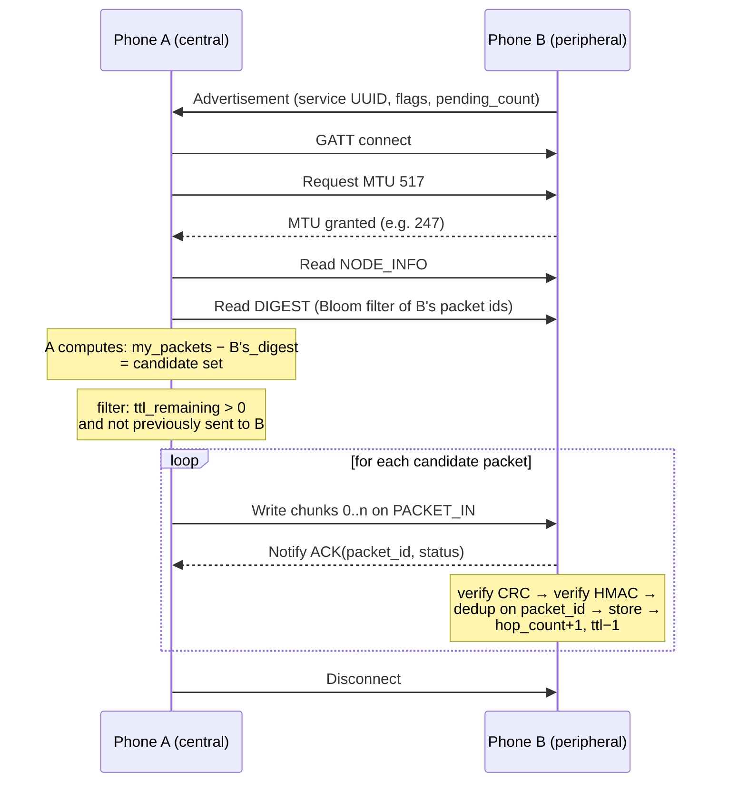

# 06 — BLE Mesh Protocol (Bulig Relay Protocol v1)

The heart of the project. This document specifies how an emergency packet moves
between phones with no infrastructure.

## 6.1 Roles: every device is both server and client

A device that only scans can never *receive*. A device that only advertises can
never *forward*. So every Bulig install runs both GATT roles concurrently inside
a single foreground service:

- **Peripheral role** — advertises the Bulig service UUID; hosts the GATT
  characteristics below; accepts writes from peers.
- **Central role** — scans for the Bulig service UUID; connects to discovered
  peers; writes packets to them.

The service alternates duty cycles (advertise window / scan window) rather than
running both continuously, to bound battery cost. Defaults in `settings`:
scan 10 s every 60 s, advertise continuously at `ADVERTISE_MODE_BALANCED`.

## 6.2 GATT profile

**Service UUID** `03aa6000-8bad-4f9a-9c1e-1000c0de6000`.

An earlier draft of this document wrote the suffix as `bul16000`. That is not
hexadecimal, so `UUID.fromString` throws on it and the service would have died
on its first line — on a device, in a field test, with nothing to say why. The
UUIDs above are randomly generated and valid. `GattContractTest` now parses
every one of them, so the defect cannot come back silently.

TO BE VALIDATED: these have not been checked against the Bluetooth SIG's
assigned-numbers list before pilot deployment.

| Characteristic | UUID suffix | Properties | Purpose |
|---|---|---|---|
| `DIGEST` | `…6001` | Read, Notify | Peer's Bloom-filtered set of held packet IDs |
| `PACKET_IN` | `…6002` | Write, Write-No-Response | Inbound chunk stream |
| `ACK` | `…6003` | Notify | Per-packet acknowledgement / rejection reason |
| `NODE_INFO` | `…6004` | Read | Device id, protocol version, `has_internet` flag, free slots |

The advertisement payload carries the service UUID plus 4 bytes of manufacturer
data: `[protocol_version:1][flags:1][pending_count:2]`. The `flags` byte's bit 0
is `HAS_INTERNET`. This lets a scanning device **prefer connecting to a peer
that can actually reach the server** — a one-byte optimisation with an
outsized effect on delivery time.

### 6.2.1 Readable characteristic layouts

Both are length-explicit and both decode to *nothing* rather than throwing, for
the same reason: a BLE read can return fewer bytes than were written, and a peer
running an older build can return bytes we do not understand. Neither is grounds
for taking down a foreground service that is meant to survive a disaster.

**`NODE_INFO`** (`NodeInfoCodec`):

```
[version:1][flags:1][pending_count:2][id_length:1][device_id:id_length]
```

The device id is **length-prefixed, not terminated**, so an id containing any
byte at all still decodes to exactly itself. A declared length that overruns the
buffer means a *truncated read*, not a short id — decoding the fragment would
mint a peer identity out of half a UUID and then trust it for the whole session,
so the decoder returns null instead. `flags` bit 0 is `HAS_INTERNET`, matching
the advertisement.

**`DIGEST`** (`DigestCodec`):

```
[hash_count:1][bloom_bits:n]
```

The hash count travels with the bits. Probing a filter built with a different
*k* using our own *k* returns wrong answers in the **unsafe** direction: false
negatives merely waste airtime, but false positives would silently suppress a
delivery.

A digest read that returns nothing is treated by the session as an *empty*
filter — the peer is assumed to hold nothing and is offered everything. That
risks re-sending, which costs airtime. The opposite assumption would risk never
sending, which costs a delivery.

## 6.3 Session flow (anti-entropy)



Exchanging a **digest before any payload** means a packet is never transmitted
to a peer that already holds it. This is classic epidemic-routing anti-entropy,
and it is what keeps a dense cluster of phones from saturating the air with
redundant copies.

The digest is a 256-byte Bloom filter with 3 hash functions — false positives
(~1% at 200 packets) cause a packet to be *skipped*, never duplicated, and the
next session with a different filter state will catch it. That failure direction
is the safe one.

## 6.4 Wire format

ATT MTU after negotiation is typically **185–517 bytes**, and an emergency with
a description exceeds that. Packets are therefore chunked.

**Chunk frame** (written to `PACKET_IN`):

```
 0        1        2        3        4                     n
+--------+--------+--------+--------+---------------------+
| VER    | FLAGS  | SEQ    | TOTAL  |  PAYLOAD FRAGMENT   |
+--------+--------+--------+--------+---------------------+
  1 byte   1 byte   1 byte   1 byte    up to (MTU-3-4)
```

- `VER` — protocol version (`0x01`)
- `FLAGS` — bit 0 `FIRST`, bit 1 `LAST`, bit 2 `COMPRESSED`
- `SEQ` / `TOTAL` — fragment index and count (max 255 fragments)
- The **first** fragment's payload begins with the fixed 84-byte packet header
  below; the remainder is the CBOR-encoded emergency body.

**Packet header** (84 bytes, big-endian):

| Offset | Size | Field |
|---|---|---|
| 0 | 1 | `version` |
| 1 | 1 | `ttl_remaining` |
| 2 | 1 | `hop_count` |
| 3 | 1 | `flags` |
| 4 | 16 | `packet_id` (UUID, raw bytes) |
| 20 | 16 | `emergency_id` (UUID, raw bytes) |
| 36 | 16 | `origin_device_id` (UUID, raw bytes) |
| 52 | 8 | `created_at_device` (epoch ms, int64) |
| 60 | 2 | `body_length` |
| 62 | 4 | `crc32` of body |
| 66 | 16 | `hmac` (truncated HMAC-SHA256, first 16 bytes) |
| 82 | 2 | reserved |

**Body encoding — changed from the original design.** This document originally
specified CBOR. The implementation (`PacketCodec` in `:core-mesh`) uses a
field-separated encoding instead: 21 fields in a fixed order, joined by the
ASCII unit separator `0x1F`, encoded UTF-8.

The reasoning is the same one that forced the HMAC canonicalisation to be
written out explicitly in §6.7.1. The receiver is a *different device*, possibly
running a *different build*. A schema-free encoder hides that: two CBOR
libraries agreeing today is not a property any test in this project can assert,
whereas a fixed field order is round-tripped by `PacketCodecTest` on every run.
Free text is stripped of `0x1F` on encode, so a description cannot forge a field
boundary.

The cost is size — the separated form is larger than CBOR would be. A typical
packet is **250–450 bytes total**, two to three fragments at a 247-byte MTU.
That was judged the right trade: the mesh's bottleneck is encounter opportunity,
not bytes per encounter.

The body still carries the same fields: type code, description,
affected/vulnerability counts, lat/lng/accuracy, and the life-threatening flag.

**The integrity envelope.** The encoded body is wrapped as
`[crc32:4 big-endian][body]` before framing (`PacketEnvelope`). Earlier drafts
placed the CRC in an 84-byte packet header that the implementation never
adopted, with the result that `ChunkFraming.crc32` was computed nowhere and
transmitted nowhere — the `ACK(CORRUPT)` branch of §6.5 could not fire, and a
scrambled body would have been parsed as a real report.

BLE's link layer already CRCs each radio packet, so this is not about radio
noise. It catches corruption produced one layer up, by *our own* framing:
fragments reassembled in the wrong order, a buffer collision between two peers,
a truncated final write. Each fragment arrives intact, so the radio's own check
sees nothing wrong. `PacketEnvelopeTest` asserts that every single-byte
corruption of a realistic body is detected.

Reassembly buffers are keyed by `(peer_address, packet_id)` and discarded after
a **10-second** inactivity timeout, so a peer that walks out of range mid-transfer
cannot leak memory.

## 6.5 Receive algorithm

```
on complete reassembly:
    if version unsupported            -> ACK(UNSUPPORTED);  drop
    if crc32 mismatch                 -> ACK(CORRUPT);      drop
    if packet_id in seen_set          -> ACK(DUPLICATE)
                                         log DUPLICATE_SUPPRESSED
                                         drop            # ← loop suppression
    if hmac invalid (key known)       -> ACK(INVALID_HMAC); log; drop
    if hmac unverifiable (no key)     -> carry it anyway  # ← see below
    if ttl_remaining == 0             -> store, mark NOT forwardable
                                         log TTL_EXPIRED
                                         ACK(ACCEPTED_TERMINAL)
    else:
        store packet
        hop_count    += 1
        ttl_remaining -= 1
        mark forwardable
        add packet_id to seen_set
        upsert local emergency row (dedup on emergency_id)
        log RELAY_RECEIVED
        ACK(ACCEPTED)
```

**`packet_id` is never regenerated.** A relay rewrites only `ttl_remaining`,
`hop_count`, and the HMAC-excluded header bytes. If each hop minted a new packet
id, the seen-set would never match and packets would circulate until TTL burned
out — turning an optimisation into a broadcast storm. This is the most important
single line in the specification.

### 6.5.1 Why a relay carries what it cannot verify

The `(key known)` qualifier above is load-bearing. **A relay does not hold other
devices' keys** — only the server, which provisioned them, can adjudicate a
signature. `PacketSigner.verifyOwn` is named that narrowly for this reason.

So a relay's honest answer about a stranger's packet is *"I cannot tell"*, and
the packet is carried regardless. The alternative — refusing to relay anything
it cannot personally verify — would leave every device able to carry only its
own reports, which is not a mesh at all.

`Verification` encodes this as three outcomes rather than a boolean:
`VALID`, `INVALID` (checked against a key we hold, and wrong — refuse), and
`UNKNOWN_KEY` (carry it; the server decides). Only `INVALID` produces
`ACK(INVALID_HMAC)`.

The tamper protection is therefore not lost, only *deferred*: a relay cannot
alter a report without the **server** detecting it on arrival, because the
signature excludes exactly the two fields a relay is allowed to change (§6.7.2).

## 6.6 TTL and hop count

Default `ttl_initial = 10` (configurable in `settings`).

| Node | `hop_count` | `ttl_remaining` |
|---|---|---|
| Origin A | 0 | 10 |
| B | 1 | 9 |
| C | 2 | 8 |
| … | … | … |
| Terminal | 10 | 0 |

At `ttl_remaining == 0` the packet is still **stored and still syncable** — it
simply stops being forwarded over BLE. A packet that reaches its last hop on a
phone that later gets signal must still reach the server; discarding it would
throw away a delivered report.

Forwarding eligibility also requires: not previously sent to this peer in this
session, battery above the configured floor (default 15%), and packet age below
the configured maximum (default 24 h).

## 6.7 Integrity: relays cannot tamper

A packet passes through strangers' phones. On registration the server issues each
device a random 32-byte `hmac_key`. The **origin** device signs a canonical
representation of the packet; the server verifies it on ingest.

Relays cannot verify the MAC — they do not hold other devices' keys — so they
carry it opaquely. A tampered payload is stored with `status = INVALID_HMAC` and
surfaced on the command center's network monitoring page rather than silently
dropped, because evidence of tampering is itself operationally interesting.

### 6.7.1 The canonical string — a cross-language contract

The signed bytes are **not** a JSON dump. Kotlin cannot reproduce PHP's
`json_encode` byte-for-byte: PHP escapes forward slashes by default, the two
languages format floating-point differently, and their Unicode escaping rules
diverge. Signing a JSON encoding would mean every real device's packets failing
verification on arrival.

The canonical string is therefore defined explicitly, in a fixed field order:

```
bulig.canon.v1
<text>   packet_id
<text>   emergency_id
<text>   origin_device_id
<text>   created_at_device   (epoch milliseconds, as digits)
<text>   payload.type_code
<text>   payload.description
<int>    payload.affected_count
<int>    payload.children_count
<int>    payload.elderly_count
<int>    payload.mobility_limited_count
<bool>   payload.is_life_threatening
<text>   payload.vulnerability_notes
<text>   payload.latitude          (fixed 7 decimal places)
<text>   payload.longitude         (fixed 7 decimal places)
<text>   payload.accuracy_m        (fixed 2 decimal places)
<text>   payload.location_provider
<text>   payload.captured_at       (epoch milliseconds, as digits)
```

Fields are joined with `\n`. Encoding rules:

| Type | Rule |
|---|---|
| `<text>` | `<utf8ByteLength>:<text>` — length-prefixed |
| `<int>` | decimal digits, no padding |
| `<bool>` | `1` or `0` |
| decimals | rendered to the stated scale, then length-prefixed as text |
| null / absent | the empty text field, `0:` |

**Why length prefixes.** A description containing a newline would otherwise be
able to impersonate a field boundary and let two different packets canonicalise
identically. The prefix makes that impossible, and it is trivial to implement in
both languages.

**Why epoch milliseconds.** Date *formatting* differs between platforms and
locales; an instant does not. `2026-08-27T03:52:11Z` and `2026-08-27T11:52:11+08:00`
are the same packet and must produce the same signature.

**Why coordinates are fixed-scale.** Seven decimal places is roughly 11 mm —
far beyond any phone GPS. Devices must not send more precision than that.

The MAC is `HMAC-SHA256(device_key, canonical)`, truncated to the first **32 hex
characters** (16 bytes) for the wire header.

### 6.7.2 What is excluded, and why

`ttl_remaining` and `hop_count` are **deliberately outside** the signed bytes.
Relays must be able to decrement them without invalidating the origin's
signature — that is precisely what lets an untrusted phone carry a packet it
cannot forge.

### 6.7.3 The shared test vector

One fixture is asserted in **both** suites — `CanonicalPacketTest` in PHP and
`CanonicalPacketTest.kt` in Kotlin — with the same expected MAC. It deliberately
includes a description containing a newline, a forward slash and non-ASCII
characters, a null field, a negative coordinate, and an accuracy value requiring
rounding.

If the two implementations ever drift apart, a test goes red. Without this
vector, the failure mode is silent: the backend's own tests would still pass
(they would share the bug), and the problem would surface only as "the mesh
doesn't work" during device testing.

### 6.7.4 What this does not provide

Authentication of origin and detection of modification — not confidentiality.
Payloads are **not encrypted** between devices; a BLE sniffer in range could read
a report in transit. Documented in `LIMITATIONS.md` as future work, not claimed
as a feature.

## 6.8 Android platform realities

| Constraint | Handling |
|---|---|
| Android 12+ requires `BLUETOOTH_SCAN` / `ADVERTISE` / `CONNECT` | Runtime permission flow with a plain-language rationale screen |
| Scan results throttled when the screen is off | Foreground service, `ScanSettings.SCAN_MODE_LOW_LATENCY` during active windows only |
| Background execution limits | `ForegroundServiceType` `connectedDevice` + `location`; persistent notification |
| Some devices cap concurrent GATT connections (often 4–7) | Connection pool with a hard cap of 3 and LRU eviction |
| Manufacturer battery managers kill services | Onboarding prompts the user to exempt Bulig from battery optimisation |
| Advertising unsupported on some older chipsets | Detected at startup; device degrades to **central-only** and the UI says so honestly |
| BLE range is roughly 10–30 m and is degraded by walls, bodies, rain, and 2.4 GHz congestion | Never claimed otherwise in the UI or the paper |

## 6.9 Testability without radios

Relay, dedup, TTL, and forwarding-eligibility logic live in `:core-mesh`, a pure
Kotlin module with **no Android dependencies**, behind a `MeshTransport`
interface. A `VirtualMesh` fake wires N in-memory nodes with a configurable
topology, loss rate, and latency, so proposal TESTS 3, 4, and 5 run as
deterministic JVM unit tests in milliseconds.

Real-device testing then validates the *radio*; the automated suite validates the
*protocol*. Both belong in the defense.
