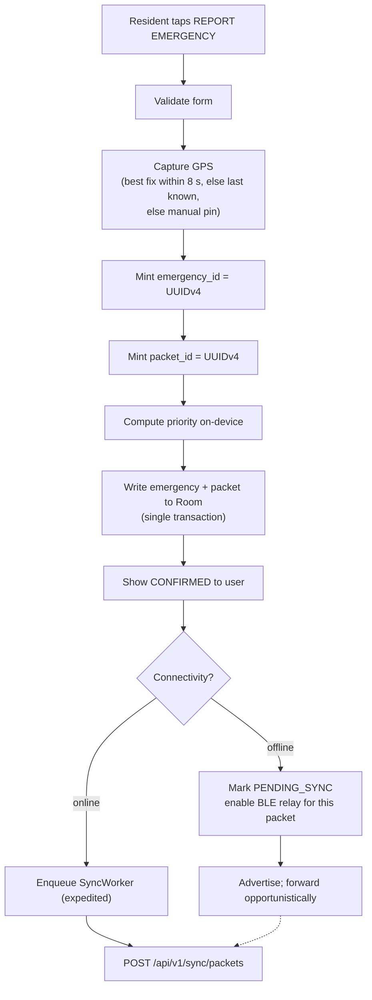

# 07 — Offline Storage and Synchronisation

## 7.1 Local-first write path

When a resident submits a report, **nothing blocks on the network**:



The user sees confirmation at step H — after a **local** commit. This is the
difference between an offline-first app and an online app with a retry queue.

## 7.2 Device-side state machine

```
DRAFT ─▶ LOCAL_SAVED ─▶ PENDING_SYNC ─┬─▶ SYNCING ─┬─▶ SYNCED
                             ▲         │           └─▶ SYNC_FAILED ─┐
                             └─────────┴─────────────────────────────┘
                                        (backoff retry)
LOCAL_SAVED ─▶ RELAYED   (handed to ≥1 peer; still PENDING_SYNC —
                          relaying is not delivery)
```

`RELAYED` deliberately does **not** mean delivered. A packet handed to a peer may
still never reach the server. The UI reflects this distinction honestly.

## 7.3 Status vocabulary shown to users (§28)

| State | Banner | Meaning |
|---|---|---|
| 🟢 ONLINE | "Connected to command center" | Server reachable |
| 🟠 OFFLINE | "Reports are saved and will be relayed to nearby phones" | No internet; mesh active |
| 🔵 SYNCING | "Uploading N pending reports…" | Batch in flight |
| ⏳ PENDING | "N reports waiting to be delivered" | Queued |
| ✅ SYNCED | "Delivered to command center" | Server acknowledged |
| 📡 RELAYED | "Passed to N nearby phones" | Handed off, not yet confirmed |

The banner is persistent and never collapsed away. Per §28 this is a core
feature, not a status detail.

## 7.4 Sync worker

`WorkManager` periodic (15 min) + expedited on connectivity regain, with
`NetworkType.CONNECTED` constraint.

- **Batching:** up to 50 packets per request (configurable).
- **Ordering:** highest priority first, then oldest first. If the connection
  window is short, the critical reports go first.
- **Backoff:** exponential, 30 s → 15 min cap, with jitter to prevent a thundering
  herd when a whole barangay regains signal simultaneously.
- **Partial success:** the response reports per-packet outcomes; only accepted
  and duplicate packets are marked done. Rejected ones stay queued unless the
  rejection is permanent (`INVALID_HMAC`, `UNSUPPORTED_VERSION`).
- **Pull:** the same worker pulls assignment and status changes for responders.

## 7.5 Idempotency — the contract

`POST /api/v1/sync/packets` is idempotent. Submitting a batch twice yields the
same database state as submitting it once.

Server-side, per packet:

```
BEGIN TRANSACTION
  if packet_id exists            -> status=DUPLICATE, log, continue
  verify hmac                    -> if invalid: status=INVALID_HMAC, log, continue
  insert emergency_packets row
  upsert emergencies ON emergency_id:
      if new     -> insert, assign emergency_code, compute priority
      if exists  -> DO NOT overwrite operator-modified fields
                    (status, priority override, assignments);
                    only fill nulls and record the additional route
  insert packet_logs
COMMIT
```

The upsert rule matters: a packet arriving late by a slow route must never
resurrect a resolved incident or wipe an operator's triage. **Late packets add
routing evidence; they do not rewrite operational state.**

## 7.6 Clock skew

Offline phones drift. Every sync request carries `client_clock` in the envelope;
the server records `clock_offset_ms = client_clock − server_clock` on each
packet.

Reported transmission delay is then computed against the *corrected* origin time:

```
delay_ms = received_at_server − (created_at_device − clock_offset_ms)
```

Without this correction, a phone whose clock is 40 minutes fast produces a
negative transmission delay, and the evaluation chapter reports nonsense. Any
packet whose corrected delay is still negative is flagged
`clock_anomaly = true` and excluded from delay statistics rather than silently
averaged in.

## 7.7 Conflict resolution

| Conflict | Resolution |
|---|---|
| Same emergency via two routes | Dedup on `emergency_id`; both packets kept as routing evidence |
| Same packet twice | Dedup on `packet_id`; second marked `DUPLICATE` |
| Device edits after server triage | Server operational state wins |
| Responder status update offline | Last-write-wins by device timestamp, corrected for skew; both retained in `status_history` |
| Device clock in the future | `clock_anomaly` flag; excluded from timing metrics |

## 7.8 What the server never assumes

- That packets arrive in causal order.
- That a packet's emergency row already exists.
- That a device is honest — hence HMAC verification.
- That a device will ever come back — hence no server-side sessions across syncs.
