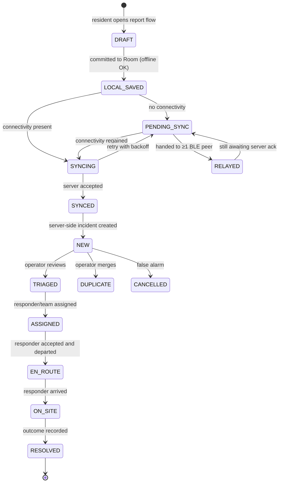

# 09 — Workflows

## 9.1 Emergency lifecycle



Device-side states (`DRAFT`…`SYNCED`) and server-side states (`NEW`…`RESOLVED`)
are separate vocabularies joined at `SYNCED → NEW`. Merging them would force the
device to know about triage, which it cannot while offline.

## 9.2 End-to-end multi-hop scenario

```mermaid
sequenceDiagram
    autonumber
    participant R as Resident (Phone A, offline)
    participant B as Phone B (offline)
    participant C as Phone C (has signal)
    participant S as Laravel API
    participant O as Operator
    participant P as Responder

    R->>R: Create report → Room (emergency_id, packet_id, TTL 10, hop 0)
    R->>R: Show CONFIRMED (no network involved)
    R-->>B: BLE: digest exchange → packet transfer
    B->>B: dedup miss → store; hop 1, TTL 9
    B-->>C: BLE: digest exchange → packet transfer
    C->>C: dedup miss → store; hop 2, TTL 8
    C->>S: POST /sync/packets (batch)
    S->>S: verify HMAC → dedup on packet_id → upsert on emergency_id
    S->>S: assign BLG-2026-0417 · compute priority CRITICAL
    S-->>C: ACCEPTED + code + priority
    C-->>R: (later, opportunistically) status back-propagated via mesh
    S->>O: appears on dashboard, top of queue
    O->>S: assign Team Alpha
    S->>P: /sync/pull → assignment
    P->>S: ACCEPT → EN_ROUTE → ON_SITE → RESOLVED
    S->>O: timeline updates live
```

Step 2 is the project's thesis: the resident is told their report is safe before
any network exists.

## 9.3 Duplicate arrival (proposal TEST 4)

```mermaid
sequenceDiagram
    participant A as Phone A
    participant B as Phone B
    participant C as Phone C
    A-->>C: packet 9b1d (direct, hop 1)
    C->>C: store; seen_set += 9b1d
    A-->>B: packet 9b1d (hop 1)
    B-->>C: packet 9b1d (hop 2)
    C->>C: packet_id in seen_set → DUPLICATE_SUPPRESSED, drop
    C->>S: syncs ONE packet
    Note over S: even if both had arrived,<br/>UNIQUE(emergency_id) yields one incident
```

Two independent defences: the device seen-set (transport) and the server unique
constraint (logical). Either alone would be sufficient in the happy path; both
together survive the failure cases.

## 9.4 Operator triage

1. Incident appears in the queue, auto-sorted by priority then age.
2. Operator opens it, reads the **priority rule trace**, and confirms or overrides.
3. Checks routing evidence — an incident that arrived at hop 3 signals a
   connectivity dead zone worth noting.
4. Assigns a responder or team based on availability and proximity.
5. Monitors status changes on the live timeline.
6. Closes out when the responder marks `RESOLVED`.

Every override and assignment writes to `audit_logs` with a reason.

## 9.5 Responder workflow

1. Assignment arrives via `/sync/pull`; the app raises a high-priority notification.
2. `ACCEPT` (or `DECLINE` with reason → returns to the operator's queue).
3. `EN ROUTE` → navigate; offline fallback shows bearing and distance.
4. `ON SITE` on arrival.
5. `RESOLVED` with outcome notes.

Every transition is written locally first and synced later, so a responder in a
dead zone loses no record. Transitions carry device timestamps corrected for
clock skew at sync.

## 9.6 Device registration

1. First launch mints a `device_id` UUID and stores it in Room.
2. When connectivity first exists, `POST /devices/register` returns a device
   token and a 32-byte `hmac_key` — **once**.
3. The key is stored in Android Keystore-wrapped preferences.
4. A device that has never registered can still **create and relay** packets; its
   HMAC simply cannot be verified until it registers, and the server records
   `hmac_valid = null` rather than rejecting.

That last point is deliberate: requiring registration before reporting would
reintroduce an internet dependency at the exact moment the system is supposed to
work without one.
